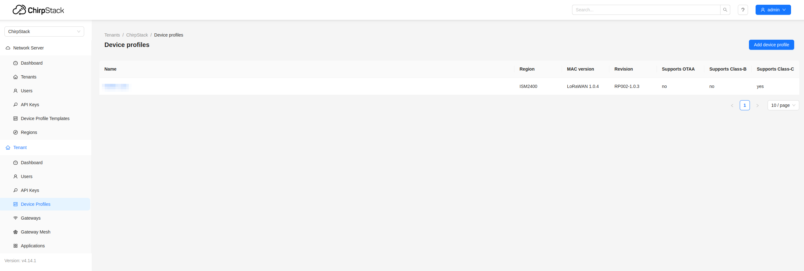
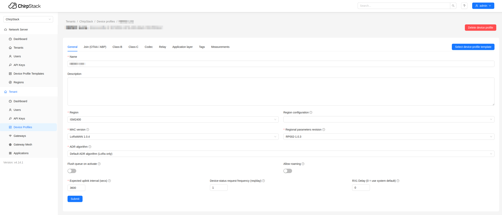

# Chirpstack Docker

This repository is a fork of the [Chirpstack Docker](https://github.com/chirpstack/chirpstack-docker) project. It contains a `docker-compose.yml` file and configuration files to run Chirpstack in Docker containers, modified to support the ISM2400 frequency band.

## Setup

To set up Chirpstack with ISM2400 support, follow these steps:
1. Clone this repository:
   ```bash
   git clone https://github.com/IRNAS/chirpstack-docker.git
   ```
2. Navigate to the cloned directory:
   ```bash
    cd chirpstack-docker
    ```
3. Modify the `docker-compose.yml` file to use the ISM2400 configuration:
4. Start the services using Docker Compose:
   ```bash
   docker-compose up -d
   ```
5. Access the Chirpstack web interface at `http://localhost:18080`.
6. Log in with the default credentials:
   - Username: `admin`
   - Password: `admin`
7. Change the default password after logging in for the first time.

## Adding a Gateway

Add the Gateway in the Chirpstack web interface using the Gateway EUI. Additional configuration on the gateway may be required.

## Adding a Device

### Create a Device Profile

Before adding a device, create a device profile that matches your device's specifications:
1. Navigate to the "Device Profiles" section in the Chirpstack web interface.
2. Create a new device profile with the appropriate settings for your device.

In our case, the configuration should be as follows:




### Add the Device

Our devices in the ISM2400 band use ABP activation. To add a device:
1. Navigate to the "Applications" section in the Chirpstack web interface.
2. Create a new application if you haven't already.
3. Within the application, add a new device.
4. Enter the Device EUI and select the Device profile.
5. Once the device has been added, navigate to the `Activation` tab of the device.
6. Add the `Device address`, `Network Session Key`, and `Application Session Key`.
7. Once the device is added, you should start seeing data in the `LoRaWAN frames` tab.